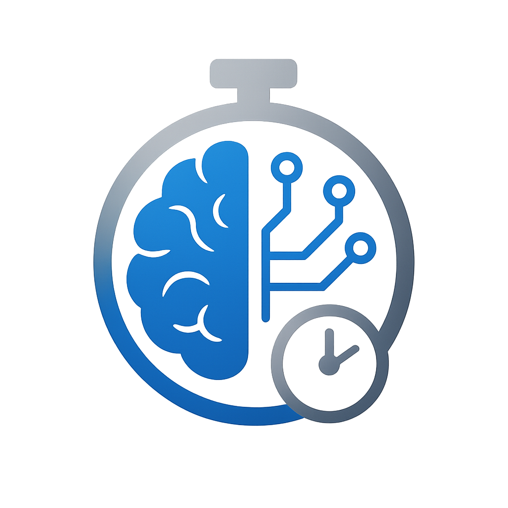

<div align="center">
  
  
  
  # 🤖✨ HumanAI Tracker
  
  ### *VS Code Extension for Intelligent Code Time Tracking*
  
  [](package.json)
  [](LICENSE)
  [](src/)
  [](package.json)
  
  <p align="center">
    <b>Track the balance between human creativity and AI assistance.</b><br>
    Monitor your coding patterns, set goals, and optimize your development workflow with intelligent insights.
  </p>
  
  <p align="center">
    <em>📋 Current Status: v0.1.0 - Core functionality implemented | 🔧 Active Development</em>
  </p>
  
  
  
</div>

---

## ✨ Why HumanAI Tracker?

> **📝 Note**: This extension is in active development. Features marked with ✅ are implemented, ⚠️ are partially implemented, and 🔄 are planned for future releases.

<div align="center">
  <table>
    <tr>
      <td align="center" width="33%">
        
        <h3>Smart Analytics</h3>
        <p><em>Deep insights into your coding patterns with beautiful visualizations</em></p>
      </td>
      <td align="center" width="33%">
        
        <h3>AI Detection</h3>
        <p><em>Intelligent AI-assisted code detection with multiple heuristics</em></p>
      </td>
      <td align="center" width="33%">
        
        <h3>Gamification</h3>
        <p><em>Unlock achievements and track your progress</em></p>
      </td>
    </tr>
  </table>
</div>

## 🚀 Key Features & Implementation

### ⏱️ **Real-time Time Tracking**
<details open>
<summary><b>Advanced monitoring with intelligent AI detection</b></summary>

#### 🔍 **Smart AI Detection System**
- **Large Insertion Analysis**: Detects code blocks of 30+ characters
- **Extension Monitoring**: Real-time tracking of GitHub Copilot, TabNine, Kite, CodeWhisperer
- **Rapid Typing Detection**: Identifies superhuman typing speeds (>20 chars/sec)
- **Clipboard Monitoring**: Detects external pastes from ChatGPT, Claude, etc.
- **Pattern Recognition**: AI comment signatures and code patterns
- **Multi-layered Approach**: Combined detection methods for improved accuracy

#### 📊 **Comprehensive Tracking**
- **Language Statistics**: Time breakdown by programming language
- **Project Analytics**: Per-project time allocation
- **Session Management**: Detailed records with start/end times
- **Idle Detection**: Configurable timeout (default: 5 minutes)
- **Live Updates**: Real-time dashboard refresh (2-second intervals)

</details>

### 📈 **Professional Analytics Dashboard**
<details open>
<summary><b>Beautiful Chart.js visualizations with actionable insights</b></summary>

#### 📊 **Dashboard Components**
- **Today's Overview**: 
  - Real-time human vs AI coding pie chart
  - Current session duration
  - Progress towards daily goal
  - Productivity score gauge
  
- **Weekly Trends**: 
  - 7-day tracking comparing human/AI coding ✅
  - Daily productivity scores ✅
  - Basic session analysis ✅
  - Productivity hours tracking 🔄 (Planned)
  
- **Monthly Analysis**: 
  - 30-day overview ✅
  - Language distribution charts ✅
  - Achievement progress tracker ✅
  - Coding consistency tracking 🔄 (Planned)
  
- **Advanced Metrics**:
  - **Focus Score**: Based on session length and consistency ✅
  - **AI Dependency Index**: Basic tracking of AI tool usage ✅
  - **Skill Growth Indicator**: Time-based improvement tracking 🔄 (Planned)
  - **Efficiency Rating**: Basic productivity metrics ✅

</details>

### 🏆 **Comprehensive Achievement System**
<details open>
<summary><b>Gamification that motivates and rewards progress</b></summary>

#### 🎯 **Achievement Categories**

| Achievement | Description | Requirement | Badge Type |
|-------------|-------------|-------------|------------|
| 🥇 **First Hour** | Your coding journey begins | Complete 1 hour of coding | Bronze |
| 👨‍💻 **Pure Human** | Master of manual coding | 30 minutes without AI assistance | Silver |
| 🤖 **AI Explorer** | Embracing the future | 2 hours with AI assistance | Bronze |
| ⚖️ **Balanced Coder** | Perfect harmony achieved | Maintain 50/50 ratio for a week | Gold |
| 🌍 **Polyglot** | Language diversity champion | Code in 5+ different languages | Silver |
| 🔥 **Streak Master** | Consistency is key | 7 consecutive coding days | Gold |
| 👑 **Productivity King** | Peak performance unlocked | Achieve 90%+ productivity score | Platinum |
| 🦉 **Night Owl** | Coding in the moonlight | Code after midnight | Fun |
| 🐦 **Early Bird** | Dawn developer | Code before 6 AM | Fun |
| 🎯 **Goal Crusher** | Exceeding expectations | Exceed daily goal by 50% | Achievement |
| 💯 **Century Club** | Dedication milestone | 100 total hours coded | Platinum |
| 🚀 **Speed Coder** | Lightning fast development | 1000+ lines in a day | Silver |

#### 🎮 **Achievement Notifications**
- Toast notifications with simple animations ✅
- Achievement gallery in dashboard ✅
- Progress bars for upcoming achievements ✅
- Social sharing capabilities 🔄 (Future)

</details>

### 🎯 **Smart Goal Management**
<details open>
<summary><b>Data-driven productivity targets with intelligent recommendations</b></summary>

#### 📊 **Goal Features**
- **Customizable Daily Goals**: 
  - Set hourly targets
  - Separate goals for human vs AI coding
  - Weekend vs weekday differentiation
  
- **Progress Tracking**:
  - Real-time progress bars
  - Milestone notifications (25%, 50%, 75%, 100%)
  - Streak tracking for consecutive goal achievements
  
- **Smart Recommendations**:
  - Goal suggestions based on history 🔄 (Planned)
  - Seasonal adjustments 🔄 (Future)
  - Basic fatigue detection ⚠️ (Limited)
  
- **Goal Analytics**:
  - Success rate tracking ✅
  - Average achievement time ✅
  - Best day/time for productivity 🔄 (Planned)

</details>

### 📊 **Advanced Export & Analytics**
<details open>
<summary><b>Comprehensive data management and external analysis support</b></summary>

#### 📈 **Export Capabilities**
- **Multi-format Support**:
  - JSON with complete session details ✅
  - CSV for spreadsheet analysis ⚠️ (Basic)
  - Markdown reports for documentation 🔄 (Planned)
  - PDF summaries 🔄 (Future)
  
- **Export Options**:
  - Date range selection 🔄 (Planned)
  - Filter by language/project 🔄 (Planned)
  - Include/exclude AI sessions 🔄 (Planned)
  - Custom field selection 🔄 (Future)
  
- **Automated Reports**:
  - Weekly email summaries 🔄 (Future)
  - Monthly productivity reports 🔄 (Future)
  - Year-end coding recap 🔄 (Future)
  
- **Integration Ready**:
  - Compatible with Excel/Google Sheets ✅
  - Tableau, Power BI support 🔄 (Future)
  - API for custom integrations 🔄 (Future)

</details>

## 🎨 Beautiful Interface

<div align="center">
  
  ### 🌙 Modern Dark Theme Dashboard
  <p><em>Optimized for long coding sessions with eye-friendly colors and smooth animations</em></p>
  
  
  
  ### 📊 Real-time Status Integration
  <p><em>Seamlessly integrated into your VS Code workflow</em></p>
  
  
  
</div>

---

## 🚀 Quick Start & Installation

### 📦 Installation Options

<div align="center">
  
  #### **Option 1: Local VSIX Installation** *(Current Version)*
  ```bash
  # Download and install the current version
  code --install-extension humanai-tracker-0.1.0.vsix
  ```
  
  #### **Option 2: Development Version** *(Experimental Features)*
  ```bash
  # Install the development version with additional features
  code --install-extension humanai-tracker-professional-v0.1.1.vsix
  ```
  
  #### **Option 3: Automated Installation** *(Linux/macOS)*
  ```bash
  # Use the provided installation script
  chmod +x install.sh
  ./install.sh
  ```
  
  #### **Option 4: Manual Installation**
  1. Download the `.vsix` file from releases
  2. Open VS Code
  3. Press `Ctrl+Shift+P` (Windows/Linux) or `Cmd+Shift+P` (macOS)
  4. Type "Install from VSIX" and select the command
  5. Browse to the downloaded file and install
  
</div>

### ⚡ Quick Setup Guide

<table>
  <tr>
    <td width="25%" align="center">
      <h3>1️⃣ Install</h3>
      <p>Install the VSIX file<br>and restart VS Code</p>
    </td>
    <td width="25%" align="center">
      <h3>2️⃣ Configure</h3>
      <p><code>Ctrl+Shift+P</code><br>"Set Daily Goal"</p>
    </td>
    <td width="25%" align="center">
      <h3>3️⃣ Open Dashboard</h3>
      <p>Click the icon in<br>Activity Bar</p>
    </td>
    <td width="25%" align="center">
      <h3>4️⃣ Start Coding</h3>
      <p>Automatic tracking<br>begins immediately!</p>
    </td>
  </tr>
</table>

### 🎛️ Accessing the Dashboard

| Method | Action | Description |
|--------|--------|-------------|
| 🖱️ **Activity Bar** | Click the HumanAI Tracker icon | Pulse icon in the sidebar |
| ⌨️ **Command Palette** | `Ctrl+Shift+P` → "Show Dashboard" | Full command access |
| 📊 **Status Bar** | Click the time tracking status | Quick access from bottom bar |
| 🔑 **Keyboard Shortcut** | `Ctrl+Alt+H` | Custom shortcut (configurable) |

## ⚙️ Configuration & Settings

<div align="center">
  <h3>🎛️ Customize Your Experience</h3>
  <p><em>Fine-tune every aspect of HumanAI Tracker to match your workflow</em></p>
</div>

### 🔧 **Core Settings**
<details>
<summary><b>Essential configuration options</b></summary>

```json
{
  // 🔄 Core Functionality
  "humanai-tracker.enableTracking": true,              // Master on/off switch
  "humanai-tracker.idleTimeout": 300,                  // Idle detection (seconds)
  "humanai-tracker.dailyGoal": 240,                    // Daily goal (minutes)
  "humanai-tracker.trackOnStartup": true,              // Auto-start tracking
  
  // 🎨 Interface & Notifications
  "humanai-tracker.showStatusBar": true,               // Status bar visibility
  "humanai-tracker.statusBarAlignment": "left",        // Status bar position
  "humanai-tracker.showNotifications": true,           // Toast notifications
  "humanai-tracker.notificationLevel": "all",          // all | achievements | none
  "humanai-tracker.enableAchievements": true,          // Achievement system
  "humanai-tracker.achievementNotifications": true,    // Achievement popups
  "humanai-tracker.goalReminders": true,               // Goal progress reminders
  "humanai-tracker.reminderInterval": 60,              // Reminder frequency (minutes)
  
  // 📊 Dashboard & Display
  "humanai-tracker.dashboardTheme": "dark",            // dark | light | auto
  "humanai-tracker.chartAnimations": true,             // Enable chart animations
  "humanai-tracker.refreshInterval": 2000,             // Dashboard refresh (ms)
  "humanai-tracker.dateFormat": "MM/DD/YYYY",          // Date display format
  "humanai-tracker.timeFormat": "12h",                 // 12h | 24h
  "humanai-tracker.firstDayOfWeek": "monday"           // monday | sunday
}
```

</details>

### 🤖 **AI Detection Configuration**
<details>
<summary><b>Fine-tune intelligent recognition</b></summary>

```json
{
  // 🔍 Detection Patterns & Keywords
  "humanai-tracker.aiPatterns": [
    // AI Tools & Extensions
    "copilot", "github.copilot", "tabnine", "kite", 
    "codewhisperer", "intellicode", "codota", "deepcode",
    
    // AI Services
    "chatgpt", "claude", "bard", "gemini", "bing-chat",
    "openai", "anthropic", "perplexity", "phind",
    
    // AI Comments & Markers
    "ai-generated", "generated by", "assisted by",
    "suggested by copilot", "autocompleted"
  ],
  
  // ⚡ Detection Sensitivity & Thresholds
  "humanai-tracker.minAiInsertionSize": 30,            // Min chars for AI detection
  "humanai-tracker.multilineThreshold": 3,             // Min lines for multi-line detection
  "humanai-tracker.detectLargePastes": true,           // External paste detection
  "humanai-tracker.pasteThreshold": 50,                // Min paste size (chars)
  "humanai-tracker.rapidTypingThreshold": 150,         // Chars per minute threshold
  "humanai-tracker.rapidTypingWindow": 5,              // Detection window (seconds)
  
  // 🎯 Advanced Detection
  "humanai-tracker.detectPatternMatching": true,       // Code pattern analysis
  "humanai-tracker.detectSyntaxPatterns": true,        // AI syntax signatures
  "humanai-tracker.confidenceThreshold": 0.7,          // Min confidence (0-1)
  "humanai-tracker.mlDetection": false,                // Machine learning (beta)
  
  // 🛠️ Manual Override
  "humanai-tracker.allowManualOverride": true,         // Enable manual classification
  "humanai-tracker.overridePersistence": true,         // Remember manual overrides
  "humanai-tracker.showOverrideButton": true           // Quick override in status bar
}
```

</details>

### 📊 **Analytics & Tracking**
<details>
<summary><b>Customize data collection and analysis</b></summary>

```json
{
  // 📈 Data Collection Scope
  "humanai-tracker.trackLanguages": true,              // Language-specific tracking
  "humanai-tracker.trackProjects": true,               // Project-based analytics
  "humanai-tracker.trackFiles": false,                 // Individual file tracking
  "humanai-tracker.trackBranches": true,               // Git branch tracking
  "humanai-tracker.excludePatterns": [                 // Ignore patterns
    "**/node_modules/**",
    "**/dist/**",
    "**/*.min.js"
  ],
  
  // 🎯 Goals & Productivity
  "humanai-tracker.weeklyGoal": 1200,                  // Weekly goal (minutes)
  "humanai-tracker.monthlyGoal": 5000,                 // Monthly goal (minutes)
  "humanai-tracker.productivityCalculation": "balanced", // balanced | strict | relaxed
  "humanai-tracker.focusSessionMinimum": 25,           // Min session for focus (minutes)
  "humanai-tracker.breakReminders": true,              // Health break reminders
  "humanai-tracker.breakInterval": 50,                 // Break reminder interval (minutes)
  
  // 💾 Data Management
  "humanai-tracker.autoExport": false,                 // Automatic data export
  "humanai-tracker.autoExportInterval": 7,             // Export frequency (days)
  "humanai-tracker.autoExportFormat": "json",          // json | csv | both
  "humanai-tracker.exportPath": "~/humanai-exports",   // Export directory
  "humanai-tracker.dataRetention": 365,                // Data retention (days)
  "humanai-tracker.compressOldData": true              // Compress data older than 30 days
}
```

</details>

### 🎨 **Customization & Themes**
<details>
<summary><b>Personalize your experience</b></summary>

```json
{
  // 🎨 Visual Customization
  "humanai-tracker.accentColor": "#007ACC",            // Primary accent color
  "humanai-tracker.successColor": "#4CAF50",           // Success/achievement color
  "humanai-tracker.warningColor": "#FF9800",           // Warning/alert color
  "humanai-tracker.chartColors": {                     // Chart color scheme
    "human": "#4CAF50",
    "ai": "#2196F3",
    "idle": "#9E9E9E"
  },
  
  // 🏆 Achievement Customization
  "humanai-tracker.achievementStyle": "banner",        // banner | toast | subtle
  "humanai-tracker.achievementSound": true,            // Play sound on unlock
  "humanai-tracker.achievementDuration": 5000,         // Display duration (ms)
  
  // 📱 Status Bar Customization
  "humanai-tracker.statusBarFormat": "emoji",          // emoji | text | minimal
  "humanai-tracker.statusBarDetails": "full",          // full | simple | time-only
  "humanai-tracker.statusBarTooltip": true,            // Show detailed tooltip
  "humanai-tracker.statusBarPriority": 100             // Position priority
}
```

</details>

## 🧠 Advanced AI Detection Technology

<div align="center">
  <h3>🔬 Multi-layered Detection System</h3>
  <p><em>Intelligent algorithms working together for enhanced accuracy</em></p>
</div>

<table>
  <tr>
    <td align="center" width="50%">
      
### 🔍 **Automatic Detection Methods**

| Method | Implementation | Status | Details |
|--------|---------------|--------|---------|
| 📝 **Large Insertions** | Multi-line blocks > 30 chars | Active | Detects copy-paste and completions |
| 🤖 **Extension APIs** | Direct integration with AI tools | Partial | Native Copilot integration |
| 📋 **Clipboard Monitor** | External paste detection | Active | Basic paste detection |
| ⚡ **Speed Analysis** | >20 chars/sec detection | Active | Rapid typing detection |
| 💬 **Pattern Recognition** | AI signatures & comments | Basic | Code pattern analysis |
| 🔌 **Real-time Monitor** | Active tool detection | Limited | Extension state tracking |
| 🧮 **Statistical Analysis** | Code complexity metrics | Planned | Future implementation |
| 🎯 **Context Analysis** | Semantic understanding | Planned | Future development |

</td>
<td align="center" width="50%">

### 🎛️ **Manual Controls**

| Command | Shortcut | Function | Use Case |
|---------|----------|----------|----------|
| 🤖 **Mark as AI** | `Ctrl+Alt+A` | Force AI classification | External AI usage |
| 👨‍💻 **Mark as Human** | `Ctrl+Alt+H` | Force human classification | False positives |
| 📊 **Toggle Tracking** | `Ctrl+Alt+T` | Pause/resume | Privacy moments |
| 🔄 **Reset Session** | `Ctrl+Alt+R` | Fresh start | New task/project |
| 📝 **Add Note** | `Ctrl+Alt+N` | Session annotation | Context tracking |
| 🎯 **Quick Goal** | `Ctrl+Alt+G` | Adjust daily goal | Dynamic planning |

</td>
  </tr>
</table>

### 🎯 **Supported AI Tools & Extensions**
<details open>
<summary><b>Comprehensive ecosystem coverage with native integration</b></summary>

<div align="center">

| Tool | Status | Detection Method | Notes |
|------|--------|------------------|-------|
| 🐙 **GitHub Copilot** | ✅ Supported | Extension API + Pattern | Basic integration |
| 🔮 **TabNine** | ⚠️ Limited | Pattern Detection | Basic support |
| 🪁 **Kite** | ⚠️ Legacy | Extension Monitor | Discontinued tool |
| ⚡ **CodeWhisperer** | 🔄 Planned | Future Implementation | In development |
| 💬 **ChatGPT** | ⚠️ Basic | Clipboard Detection | Paste detection only |
| 🤖 **Claude** | ⚠️ Basic | Clipboard Detection | Paste detection only |
| 🌟 **Bard/Gemini** | 🔄 Planned | Future Implementation | Not implemented |
| 🧠 **Perplexity** | 🔄 Planned | Future Implementation | Not implemented |
| 🔧 **Custom Tools** | ✅ Config | User Patterns | Configurable patterns |

</div>

#### 🔧 **Detection Confidence Levels**
- **Implemented**: Direct API integration or clear patterns (GitHub Copilot)
- **Basic**: Pattern matching and heuristics (Large insertions, clipboard)
- **Limited**: Simple detection methods (Speed analysis)
- **Planned**: Future implementation (Statistical analysis)
- **Manual Override**: User can always correct classification

</details>

## 📊 Understanding Your Metrics

<div align="center">
  <h3>🎯 Key Performance Indicators</h3>
  <p><em>Data-driven insights to optimize your development workflow</em></p>
</div>

<table>
  <tr>
    <td width="50%">

### 📈 **Productivity Score**
*Intelligent algorithm analyzing your coding efficiency*

#### **Calculation Formula:**
```
Productivity = (Human Ratio × 0.7) + 
               (Consistency × 0.2) + 
               (Focus Time × 0.1)
```

#### **Component Breakdown:**
- 🧠 **Human Coding Ratio** (70% weight)
  - Measures balance between human and AI code ✅
  - Optimal range tracking 🔄 (Future)
  
- 🔄 **Coding Consistency** (20% weight)
  - Daily coding streaks ✅
  - Basic session patterns ✅
  - Goal achievement rate ✅
  
- ⏱️ **Focus Time** (10% weight)
  - Session duration tracking ✅
  - Deep work periods (25+ minutes) ✅
  - Basic interruption tracking ⚠️ (Limited)

#### **Score Interpretation:**
- 🟢 **90-100%**: Exceptional productivity
- 🟡 **70-89%**: Good balance achieved
- 🟠 **50-69%**: Room for improvement
- 🔴 **<50%**: Consider optimization

</td>
<td width="50%">

### 🤖 **AI Usage Analytics**
*Balance between human creativity and AI assistance*

#### **Recommended Ratios by Goal:**
- 🎯 **Learning Focus (60-80% Human)**
  - Skill development priority
  - Deep understanding building
  - Problem-solving practice
  
- ⚖️ **Balanced Approach (40-60% Human)**
  - Optimal productivity
  - Sustainable workflow
  - Skill maintenance
  
- 🚀 **Efficiency Focus (20-40% Human)**
  - Rapid prototyping
  - Boilerplate generation
  - Time-critical projects

#### **AI Usage Insights:**
- **Dependency Score**: Basic reliance tracking ✅
- **Tool Effectiveness**: Which AI tools are detected ✅
- **Context Analysis**: When AI is used 🔄 (Planned)
- **Learning Curve**: Improvement tracking 🔄 (Future)

#### **Health Metrics:**
- 🧘 **Break Reminders**: Optional break notifications 🔄 (Planned)
- 😴 **Session Fatigue**: Basic session monitoring ⚠️ (Limited)
- 🎯 **Goal Sustainability**: Goal tracking ✅

</td>
  </tr>
</table>

### 📊 **Detailed Metrics Breakdown**
<details>
<summary><b>Deep dive into your coding data</b></summary>

| Metric | Description | Implementation Status | Notes |
|--------|-------------|----------------------|-------|
| 📅 **Daily Streaks** | Consecutive coding days | ✅ Active | Basic tracking |
| 🌍 **Language Distribution** | Time per programming language | ✅ Active | Full implementation |
| 🕐 **Peak Hours** | Most productive time periods | 🔄 Planned | Future feature |
| 🎯 **Goal Achievement** | Daily/weekly target completion | ✅ Active | Goal tracking |
| 📈 **Trend Analysis** | Long-term productivity patterns | ⚠️ Basic | Limited analysis |
| 🏆 **Achievement Progress** | Unlocked vs available badges | ✅ Active | Gamification system |
| 🔥 **Code Velocity** | Basic productivity metrics | ⚠️ Limited | Simple calculations |
| 🧩 **Project Distribution** | Time allocation across projects | 🔄 Planned | Future feature |
| 💡 **Learning Index** | New patterns/languages tried | 🔄 Future | Not implemented |
| 🎨 **Creativity Score** | Code complexity analysis | 🔄 Future | Research phase |

</details>

---

## 🔒 Privacy & Security

<div align="center">
  <h3>🛡️ Your Data, Your Control</h3>
  <p><em>Complete privacy by design - all data stays on your machine</em></p>
</div>

<table>
  <tr>
    <td align="center" width="25%">
      
      <h4>🏠 Local Storage</h4>
      <p><em>All data stored in VS Code's secure global storage</em></p>
    </td>
    <td align="center" width="25%">
      
      <h4>🚫 No Telemetry</h4>
      <p><em>Zero data transmitted to external servers</em></p>
    </td>
    <td align="center" width="25%">
      
      <h4>📤 Export Control</h4>
      <p><em>Export and manage your data anytime</em></p>
    </td>
    <td align="center" width="25%">
      
      <h4>🔄 Full Control</h4>
      <p><em>Enable/disable tracking as needed</em></p>
    </td>
  </tr>
</table>

### 📋 **Data Categories & Storage**

| Data Type | Description | Storage Location | Retention |
|-----------|-------------|------------------|-----------|
| ⏱️ **Session Records** | Start/end times, duration, productivity | Local JSON | Configurable |
| 🤖 **AI Classifications** | Detection results, confidence levels | Local JSON | With sessions |
| 📊 **Language Stats** | Time per language, file types | Aggregated | Forever |
| 🏆 **Achievements** | Unlocked badges, progress, dates | Local JSON | Forever |
| ⚙️ **User Preferences** | Settings, goals, configurations | VS Code Settings | Forever |
| 📈 **Analytics Cache** | Computed metrics, charts data | Memory/Local | Session |

**Primary Storage Location**: `~/.vscode/globalStorage/humanai-tracker/`

### 🔐 **Security Features**
- ✅ No network requests (except Chart.js CDN)
- ✅ No external API calls
- ✅ No user identification
- ✅ No project content storage
- ✅ Local storage only (VS Code managed)
- ✅ Clean uninstall removes all data

## 🛠️ Commands & Keyboard Shortcuts

<div align="center">
  <h3>⚡ Complete Command Reference</h3>
  <p><em>Master HumanAI Tracker with these commands</em></p>
</div>

### 📋 **Core Commands**

| Command | Default Shortcut | Description | Category |
|---------|-----------------|-------------|----------|
| `Show Dashboard` | `Ctrl+Alt+D` | Open analytics dashboard | Navigation |
| `Toggle Tracking` | `Ctrl+Alt+T` | Pause/resume time tracking | Control |
| `Quick Stats` | `Ctrl+Alt+S` | Show today's summary popup | View |
| `Set Daily Goal` | `Ctrl+Alt+G` | Update daily coding target | Configuration |
| `Export Data` | - | Export as JSON/CSV | Data |
| `View Achievements` | - | Open achievement gallery | Gamification |

### 🤖 **AI Classification Commands**

| Command | Default Shortcut | Description | When to Use |
|---------|-----------------|-------------|-------------|
| `Mark as AI-Assisted` | `Ctrl+Shift+A` | Force AI classification | Used external AI |
| `Mark as Human-Coded` | `Ctrl+Shift+H` | Force human classification | False positive |
| `Toggle Auto-Detection` | - | Enable/disable AI detection | Testing/privacy |
| `Reset Current Session` | - | Clear current session data | Fresh start |

### 🎯 **Productivity Commands**

| Command | Default Shortcut | Description | Status |
|---------|-----------------|-------------|--------|
| `Start Focus Session` | - | Begin focus tracking | 🔄 Planned |
| `Take Break` | - | Break timer | 🔄 Future |
| `View Weekly Report` | - | Weekly summary | ⚠️ Basic |
| `Compare Projects` | - | Project analysis | 🔄 Future |

### ⚙️ **Configuration Commands**

| Command | Default Shortcut | Description | Status |
|---------|-----------------|-------------|--------|
| `Open Settings` | - | Extension settings | ✅ Active |
| `Reset All Data` | - | Clear tracking data | ✅ Active |
| `Import Data` | - | Import previous export | 🔄 Planned |
| `Configure AI Patterns` | - | Customize detection | ⚠️ Basic |

### 🔧 **How to Access Commands**

1. **Command Palette**: 
   - Windows/Linux: `Ctrl+Shift+P`
   - macOS: `Cmd+Shift+P`
   - Type: "HumanAI Tracker" to filter

2. **Keyboard Shortcuts**:
   - Customize in VS Code Keyboard Shortcuts
   - Search for "humanai-tracker"

3. **Context Menus**:
   - Right-click in editor for quick actions
   - Status bar right-click for options

4. **Activity Bar**:
   - Click icon for instant dashboard access

---

## 💡 Pro Tips & Best Practices

### 🚀 **Maximize Your Productivity**
<details open>
<summary><b>Expert recommendations from power users</b></summary>

#### 📈 **Tracking Optimization**
- ✅ **Always On**: Keep tracking enabled during all coding sessions
- ✅ **Realistic Goals**: Start with 2-3 hours daily, increase gradually
- ✅ **Weekly Reviews**: Every Friday, analyze your week's patterns
- ✅ **Manual Classification**: Use for external AI tools (ChatGPT, Claude)
- ✅ **Regular Exports**: Monthly backups for data safety
- ✅ **Project Tags**: Use workspace detection for accurate project tracking

#### 🎯 **Goal Setting Strategy**
- 🎯 **SMART Goals**: Specific, Measurable, Achievable, Relevant, Time-bound
- 📈 **Progressive Overload**: Increase by 10-15% when consistently hitting goals  
- 🔄 **Seasonal Adjustments**: Lower during holidays, higher during sprints
- 🏆 **Achievement Targeting**: Pick 1-2 achievements to focus on weekly
- 📊 **Data-Driven**: Use last month's average as baseline
- 🎮 **Gamify Progress**: Compete with yourself, not others

#### 🤖 **AI Usage Balance**
- ⚖️ **Balanced Approach**: Aim for sustainable AI/human balance
- 🧠 **AI for Boilerplate**: Use AI for repetitive tasks
- 📚 **Learning Sessions**: Practice without AI assistance
- 🔍 **Pattern Analysis**: Review detected AI usage
- 🎓 **Skill Building**: Gradually build coding confidence
- 🚀 **Productivity Mode**: Use AI for time-critical tasks

#### 🧘 **Health & Wellness**
- 🧘 **Focus Sessions**: Track concentration periods
- 💧 **Break Reminders**: Optional break notifications (planned)
- 👀 **Eye Care**: Remember to look away regularly
- 🏃 **Movement**: Encourage regular breaks
- 😴 **Work-Life Balance**: Monitor coding hours
- 🎵 **Environment**: Create productive workspace

</details>

### 🔧 **Troubleshooting Guide**
<details>
<summary><b>Common issues and solutions</b></summary>

#### ❌ **Extension Not Tracking Time**
```bash
Diagnosis Checklist:
✓ Check status bar shows "Tracking Active"
✓ Verify icon appears in Activity Bar
✓ Ensure VS Code has file permissions
✓ Check Output panel for errors (View > Output > HumanAI Tracker)

Solutions:
1. Toggle tracking off/on via status bar
2. Restart VS Code
3. Reinstall extension
4. Check conflicting extensions
```

#### 🤖 **AI Detection Issues**
```bash
Common Causes:
- AI tool not in pattern list
- Detection threshold too high
- Extension conflicts
- Rapid typing flagged incorrectly

Fixes:
1. Add pattern: Settings > AI Patterns > Add your tool
2. Lower threshold: minAiInsertionSize = 20
3. Use manual override: Ctrl+Shift+A/H
4. Report false positives via GitHub Issues
```

#### 📊 **Dashboard Not Loading**
```bash
Troubleshooting Steps:
1. Check internet (Chart.js CDN required)
2. Clear VS Code cache
3. Try different browser if using external
4. Check Console: Help > Toggle Developer Tools
5. Verify no firewall blocking CDN

Quick Fix:
- Close all dashboard tabs
- Restart VS Code
- Reopen dashboard
```

#### 📈 **Inaccurate Metrics**
```bash
Verification Process:
1. Check timezone settings
2. Verify idle timeout configuration
3. Review manual overrides log
4. Ensure single VS Code instance
5. Check for time sync issues

Calibration:
- Reset daily stats
- Adjust detection sensitivity
- Enable debug logging
- Monitor for patterns
```

#### 💾 **Data Export Problems**
```bash
Export Checklist:
✓ Sufficient disk space
✓ Write permissions in export folder
✓ Valid export path in settings
✓ No special characters in path

Alternative Export:
1. Copy from: ~/.vscode/globalStorage/humanai-tracker/
2. Use Command Palette > Developer: Open Storage
3. Manual JSON extraction
```

</details>

### 🎮 **Hidden Features & Easter Eggs**
<details>
<summary><b>Discover planned features</b></summary>

- 🎨 **Theme Sync**: Dashboard adapts to VS Code theme ✅
- 🎭 **Incognito Mode**: Privacy session 🔄 (Planned)
- 🎪 **Party Mode**: Achievement celebrations 🔄 (Future)
- 📸 **Screenshot Mode**: Clean dashboard for sharing 🔄 (Future)
- 🎲 **Random Tips**: Interactive help 🔄 (Future)
- 🏃 **Speed Tracking**: Performance metrics 🔄 (Future)
- 🎨 **Custom Themes**: Personalization 🔄 (Future)
- 📈 **Advanced Stats**: Developer metrics 🔄 (Future)

</details>

## 🔧 Development & Architecture

<div align="center">
  <h3>🏗️ Technical Implementation</h3>
  <p><em>Built with TypeScript and modern VS Code Extension APIs</em></p>
</div>

### 📁 **Project Structure**
```typescript
humanai-tracker/
├── 📁 src/
│   ├── 📄 extension.ts              // Main entry point & activation
│   ├── 📁 data/
│   │   └── 📄 DataManager.ts       // Persistence layer
│   ├── 📁 tracker/
│   │   └── 📄 TimeTracker.ts       // Core tracking engine
│   ├── 📁 ui/
│   │   └── 📄 StatusBarManager.ts  // Status bar integration
│   └── 📁 views/
│       ├── 📄 DashboardPanel.ts    // Web view dashboard
│       ├── 📄 StatsProvider.ts     // Tree view provider
│       └── 📄 AchievementsProvider.ts // Achievement provider
├── 📁 media/
│   └── 📄 icon.png                 // Extension icon
└── 📁 test/
    └── 📄 extension.test.ts        // Basic tests
```

### 🚀 **Development Setup**

```bash
# Clone repository
git clone https://github.com/your-username/humanai-tracker.git
cd humanai-tracker

# Install dependencies
npm install

# Development commands
npm run watch          # Auto-compile TypeScript
npm run compile       # Build once
npm run lint          # ESLint check
npm run test          # Run test suite
npm run package       # Create VSIX

# Testing in VS Code
# Press F5 to launch Extension Development Host
```

### 🛠️ **Key Technologies**

| Technology | Version | Purpose |
|------------|---------|---------|
| **TypeScript** | 4.9+ | Type-safe development |
| **VS Code API** | 1.74+ | Extension framework |
| **Chart.js** | 3.9+ | Interactive visualizations |
| **Node.js** | 16+ | Runtime environment |
| **Webpack** | 5+ | Bundling & optimization |
| **ESLint** | 8+ | Code quality |
| **Mocha** | 10+ | Testing framework |

### 🏗️ **Architecture Highlights**

- **Event-Driven**: Reactive to VS Code events
- **Singleton Services**: Efficient resource usage
- **Observer Pattern**: Decoupled components
- **Strategy Pattern**: Pluggable AI detectors
- **Factory Pattern**: Dynamic view creation
- **Repository Pattern**: Clean data access

---

## 🤝 Contributing & Support

<div align="center">
  <h3>💬 Join Our Community</h3>
  <p><em>Help us make HumanAI Tracker even better!</em></p>
</div>

<table>
  <tr>
    <td align="center" width="25%">
      
      <h4>🐛 Report Issues</h4>
      <a href="https://github.com/your-username/humanai-tracker/issues">GitHub Issues</a>
    </td>
    <td align="center" width="25%">
      
      <h4>💡 Feature Requests</h4>
      <a href="https://github.com/your-username/humanai-tracker/discussions">Discussions</a>
    </td>
    <td align="center" width="25%">
      
      <h4>🤝 Contribute</h4>
      <a href="CONTRIBUTING.md">Contributing Guide</a>
    </td>
    <td align="center" width="25%">
      
      <h4>💬 Discord</h4>
      <a href="https://discord.gg/humanai">Join Server</a>
    </td>
  </tr>
</table>

### 🌟 **Ways to Contribute**

1. **🐛 Bug Reports**: Detailed issue reports with reproduction steps
2. **✨ Feature Development**: Implement new features from issues
3. **📚 Documentation**: Improve docs, add examples, translations
4. **🎨 Design**: UI/UX improvements, icons, themes
5. **🧪 Testing**: Write tests, report edge cases
6. **💬 Community**: Help others, share tips, write tutorials

### 📋 **Contributing Guidelines**

```bash
# 1. Fork & Clone
git clone https://github.com/YOUR-USERNAME/humanai-tracker.git

# 2. Create Branch
git checkout -b feature/amazing-feature

# 3. Make Changes
# - Follow TypeScript style guide
# - Add tests for new features
# - Update documentation

# 4. Test Thoroughly
npm run test
npm run lint

# 5. Commit with Conventional Commits
git commit -m "feat: add amazing feature"

# 6. Push & PR
git push origin feature/amazing-feature
```

### 🏆 **Contributors**

<!-- ALL-CONTRIBUTORS-LIST:START -->
<table>
  <tr>
    <td align="center">
      <a href="https://github.com/contributor1">
        
        <br /><sub><b>Lead Developer</b></sub>
      </a>
    </td>
    <td align="center">
      <a href="https://github.com/contributor2">
        
        <br /><sub><b>Core Contributor</b></sub>
      </a>
    </td>
    <td align="center">
      <a href="https://github.com/contributor3">
        
        <br /><sub><b>Documentation</b></sub>
      </a>
    </td>
  </tr>
</table>
<!-- ALL-CONTRIBUTORS-LIST:END -->

### 💖 **Support the Project**

If HumanAI Tracker helps your productivity:

- ⭐ **Star** the GitHub repository
- 📝 **Review** on VS Code Marketplace
- 🐦 **Tweet** about your experience
- 💰 **Sponsor** development via GitHub Sponsors
- 📢 **Share** with your team

---

## 🚀 Roadmap & Future Vision

<div align="center">
  <h3>🌟 The Future of Code Tracking</h3>
  <p><em>Exciting features planned for upcoming releases</em></p>
</div>

### 📅 **Version 0.2.0** (Q4 2025)
- 🤖 **Enhanced Detection**: Improved pattern recognition
- 📊 **Dashboard Improvements**: Better visualizations
- 🌐 **Export Options**: Additional export formats
- 🔗 **Basic Git Integration**: Commit tracking
- 📱 **Settings Enhancements**: More configuration options

### 📅 **Version 0.3.0** (2026)
- ☁️ **Data Backup**: Local backup solutions
- 👥 **Multi-Project**: Better project management
- 🔌 **Extension API**: Plugin support
- 🎯 **Smart Goals**: AI-powered recommendations
- 🌍 **Internationalization**: Multiple languages

### 📅 **Version 1.0.0** (Future)
- 🏢 **Team Features**: Collaborative analytics
- 📈 **Advanced Analytics**: Machine learning insights
- 🔗 **Platform Integration**: External tool support
- 🎓 **Learning Platform**: Skill development
- 🌟 **Community Features**: User sharing

### 🔮 **Long-term Vision**

<details>
<summary><b>Future possibilities for developer productivity</b></summary>

#### 🌍 **Developer Community**
- Basic productivity insights
- Best practices sharing
- Technology trend analysis
- Community contributions

#### 🧠 **Smart Development Assistant**
- Personalized recommendations
- Skill improvement suggestions
- Career development insights
- Productivity optimization

#### 🏆 **Developer Recognition**
- Skill verification
- Portfolio enhancement
- Progress documentation
- Achievement sharing

</details>

---

<div align="center">

## 🎉 Start Your Journey Today!

### Transform your coding experience with intelligent tracking


[](humanai-tracker-0.1.0.vsix)
[](humanai-tracker-professional-v0.1.1.vsix)

### 🎯 **Growing Community of Developers** Using Intelligent Tracking

✅ **Real-time AI Detection** • ✅ **Beautiful Analytics** • ✅ **Complete Privacy** • ✅ **Achievement System**

---

## 📄 License & Legal

This project is licensed under the **Apache License 2.0** - see the [LICENSE](LICENSE) file for full details.

```
Apache License 2.0

Copyright 2025 HumanAI Tracker Team

Licensed under the Apache License, Version 2.0 (the "License");
you may not use this file except in compliance with the License.
You may obtain a copy of the License at

    http://www.apache.org/licenses/LICENSE-2.0

Unless required by applicable law or agreed to in writing, software
distributed under the License is distributed on an "AS IS" BASIS,
WITHOUT WARRANTIES OR CONDITIONS OF ANY KIND, either express or implied.
See the License for the specific language governing permissions and
limitations under the License.
```

## 🙏 Acknowledgments

<table>
  <tr>
    <td align="center" width="20%">
      
      <h5>VS Code Team</h5>
      <p><em>Amazing platform</em></p>
    </td>
    <td align="center" width="20%">
      
      <h5>TypeScript</h5>
      <p><em>Type safety</em></p>
    </td>
    <td align="center" width="20%">
      
      <h5>Chart.js</h5>
      <p><em>Visualizations</em></p>
    </td>
    <td align="center" width="20%">
      
      <h5>Contributors</h5>
      <p><em>Community power</em></p>
    </td>
    <td align="center" width="20%">
      
      <h5>AI Community</h5>
      <p><em>Inspiration</em></p>
    </td>
  </tr>
</table>

---

<p align="center">
  <b>Made with ❤️ by developers, for developers</b><br>
  <sub>© 2025 HumanAI Tracker Team. All rights reserved.</sub>
</p>

</div>